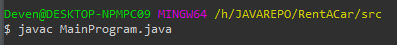

 **README:**

Vehicle Administration App

The Vehicle Administration App is a simple Java program that allows
users to manage information about different types of vehicles including
cars, motorcycles, and trucks. It provides options to add new vehicles
of each type, display all vehicles of a specific type, and exit the
program.

Features

- Add new cars, motorcycles, and trucks with details such as make,
  model, year of manufacture, and specific attributes like number of
  doors, fuel type, number of wheels, cargo capacity, and transmission
  type.
- Display all vehicles of a specific type.
- Input validation for year of manufacture, number of doors, fuel type,
  number of wheels, cargo capacity, and transmission type.

Installation

To run the program, make sure you have Java installed on your system.

1.  Clone or download the repository to your local machine.

1.  Navigate to the directory containing the source code files
    (MainProgram.java).

1.  Compile the Java source file using the following command:

1.  Run compiled program using the following command:

Usage

Upon running the program, you will be presented with a menu with the
following options:

1.  **Add Car**: Allows you to add a new car to the system. You will be
    prompted to enter details such as make, model, year of manufacture,
    number of doors, and fuel type.
2.  **Add Motorcycle**: Allows you to add a new motorcycle to the
    system. You will be prompted to enter details such as make, model,
    year of manufacture, number of wheels, and motorcycle type.
3.  **Add Truck**: Allows you to add a new truck to the system. You will
    be prompted to enter details such as make, model, year of
    manufacture, cargo capacity, and transmission type.
4.  **Display all Cars**: Displays a list of all cars stored in the
    system, along with their details.
5.  **Display all Motorcycles**: Displays a list of all motorcycles
    stored in the system, along with their details.
6.  **Display all Trucks**: Displays a list of all trucks stored in the
    system, along with their details.
7.  **Exit**: Exits the program.

Method Details

‘addCar()’

- Prompts the user to enter details of a new car.
- Validates the input for year of manufacture, number of doors, and fuel
  type.
- Creates a new Car object and adds it to the list of cars.

‘addMotorcycle()’

- Prompts the user to enter details of a new motorcycle.
- Validates the input for year of manufacture, number of wheels, and
  motorcycle type.
- Creates a new Motorcycle object and adds it to the list of
  motorcycles.

‘addTruck()’

- Prompts the user to enter details of a new truck.
- Validates the input for year of manufacture, cargo capacity, and
  transmission type.
- Creates a new Truck object and adds it to the list of trucks.

‘getValidYearOfManufacture()’

- Prompts the user to enter the year of manufacture.

<!-- -->

- Validates that the input is within the valid range (1001-2024).

‘getValidNumberOfDoors()’

- Prompts the user to enter the number of doors for a car.

<!-- -->

- Validates that the input is greater than zero.

‘getValidFuelType()’

- Prompts the user to enter the fuel type for a car.

<!-- -->

- Validates that the input is either "Petrol", "Diesel", or "Electric".

‘getValidNumberOfWheels()’

- Prompts the user to enter the number of wheels for a motorcycle.

<!-- -->

- Validates that the input is greater than zero.

‘getValidMotorcycleType()’

- Prompts the user to enter the type of motorcycle.

<!-- -->

- Validates that the input is either "Sport", "Cruiser", or "Off-road".

‘getValidCargoCapacity()’

- Prompts the user to enter the cargo capacity for a truck.

<!-- -->

- Validates that the input is greater than zero.

‘getValidTransmissionType()’

- Prompts the user to enter the transmission type for a truck.

<!-- -->

- Validates that the input is either "Manual" or "Automatic".

‘displayAllCars()’

Displays details of all cars stored in the system.

‘displayAllMotorcycles()’

- Displays details of all motorcycles stored in the system.

‘displayAllTrucks()’

- Displays details of all trucks stored in the system.

Contributing

Contributions are welcome! If you find any issues or have suggestions
for improvements, feel free to open an issue or create a pull request.
